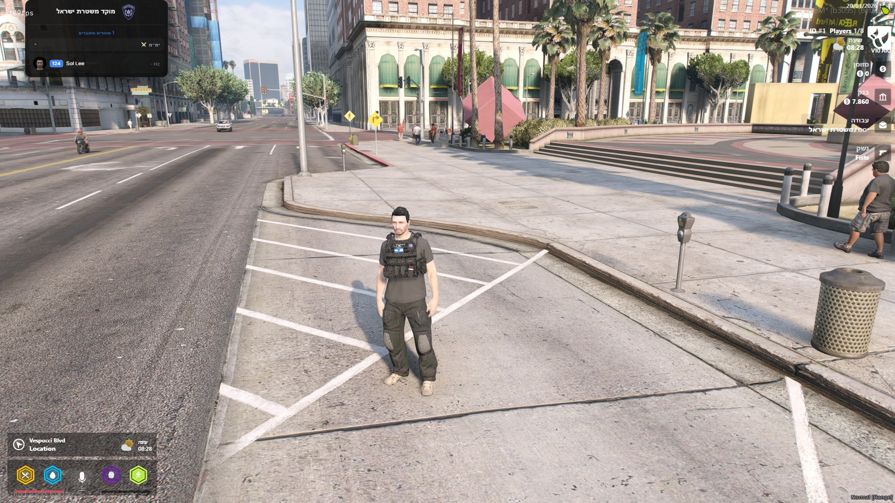
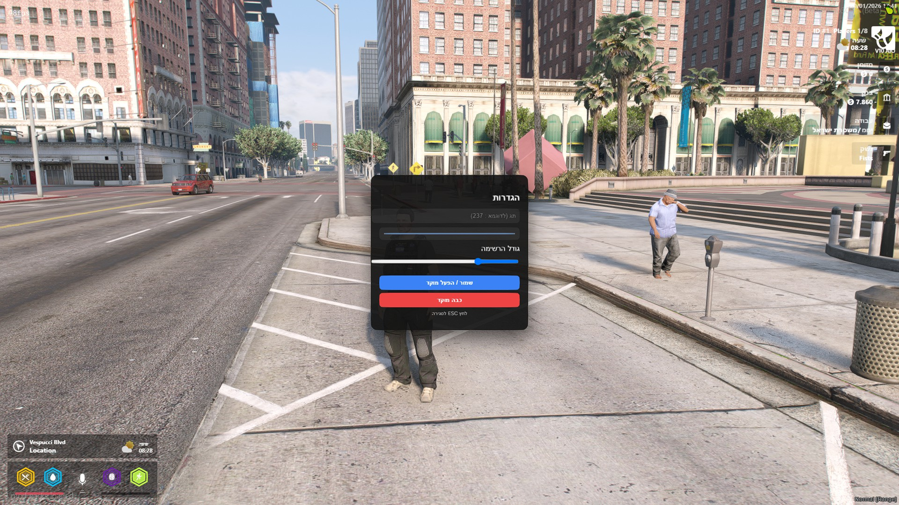

# QB 10-System HUD

A modern, lightweight and fully synchronized 10-system HUD for **FiveM** servers running **QBCore**,  
designed specifically for law enforcement roles.

This resource provides a clean and immersive way to display all online officers, their callsigns, radio channels, departments and live radio activity — with a focus on stability, performance and usability.

---

## ✨ Features

- 📋 **Live Officer List**
  - Displays all connected officers in real time
  - Automatically updates on join, leave, job change or reconnect

- 🏢 **Department Grouping**
  - Officers are grouped by department (based on job grade)
  - Fully configurable department names
  - Expand / collapse each department
  - Internal sorting by callsign (lower = higher priority)

- 🎙️ **Radio Integration**
  - Real-time radio channel display
  - Visual indication when an officer is talking on the radio
  - Fully compatible with **PMA-Voice** and **QB-Radio**

- 🖼️ **Player Headshots**
  - Automatic FiveM headshot rendering
  - No manual image uploads required

- ⚙️ **In-Game Settings (F10)**
  - Toggle HUD on/off
  - Set callsign and color
  - Drag & save HUD position
  - Resize HUD (scale)
  - All settings saved locally

- 🎨 **Clean & Modern UI**
  - Dark, minimalistic design
  - Smooth hover effects
  - Clear visual hierarchy
  - RTL support (Hebrew-friendly)

- 🚀 **Optimized & Stable**
  - No constant loops or spam updates
  - Server-side cleanup to prevent ghost players
  - Safe handling of reconnects and player drops

## 📸 Preview



---

## 📦 Dependencies

- **qb-core**
- **qb-radio**
- **pma-voice**

---

## 🛠️ Installation

1. Clone or download this repository
2. Place the folder inside your `resources` directory
3. Ensure the resource in `server.cfg`:
   ```cfg
   ensure qb-10hud
